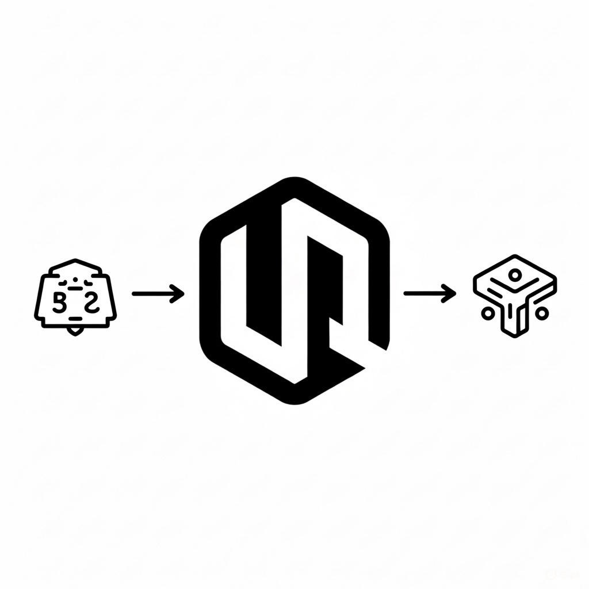
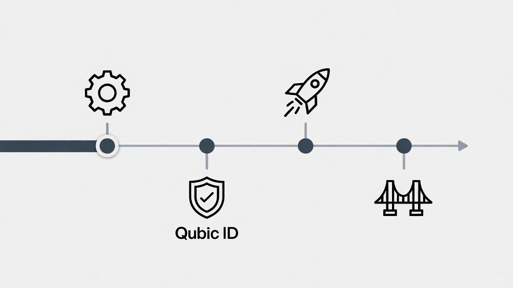
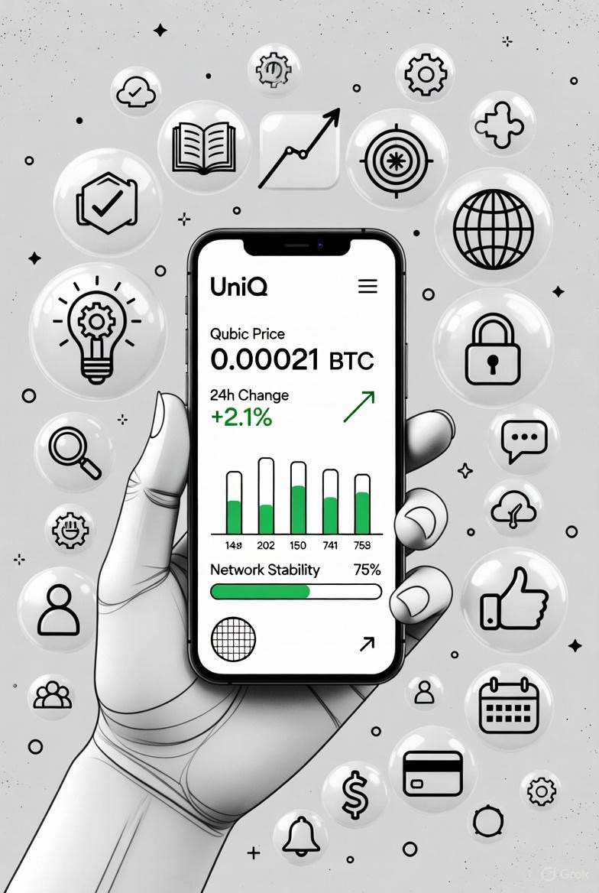

# 💎 UniQ: The Gateway to the Qubic Ecosystem

---

## 🚀 Executive Summary

Click to expand

UniQ is an all-in-one mobile platform that accelerates Qubic adoption.  
We combine real-time ecosystem tracking with a gamified Learn-to-Earn system to turn passive observers into educated, active Qubic holders.

**App Overview Mockup:**  

**Executive Summary & Core Engine Features:**  

---

## 🌟 Core Features

Click to expand

| Feature | Icon | Description |
|---------|------|-------------|
| Learn-to-Earn | 🎓 | Interactive quizzes with UNIQ rewards |
| Ecosystem Tracker | 📊 | Live updates on Qubic projects |
| Market & Macro | 📈 | Real-time pricing & sentiment |
| Community | 💬 | Verified chat via Qubic ID |

**Core Features Mockup:**  

---

## 💰 Tokenomics: UNIQ

Click to expand

* Phase 1: Internal rewards for learning and engagement  
* Phase 2: Optional swap to QUBIC or native QUBIC rewards  
* Total Supply: 20,000,000 UNIQ

**Tokenomics Mockup:**  

**Detailed Reward Flow (Phase 1 & Phase 2):**  

---

## 🛠 Technical Roadmap

Click to expand

* Identity: Qubic ID login  
* Governance: Optional smart contract reward logic  
* Infrastructure: Flutter frontend + Node.js backend for real-time data

**Roadmap Mockup:**  

**Timeline / Milestones:**  

---

## 💡 Why UniQ for Qubic?

Click to expand

* Easy onboarding for non-technical users  
* Consolidated ecosystem data in one app  
* Educated users reduce FUD and panic selling

**Value Proposition Mockup:**  

**Detailed User Benefits:**  

