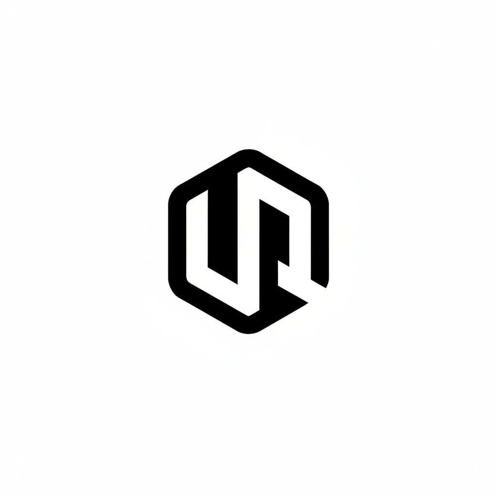
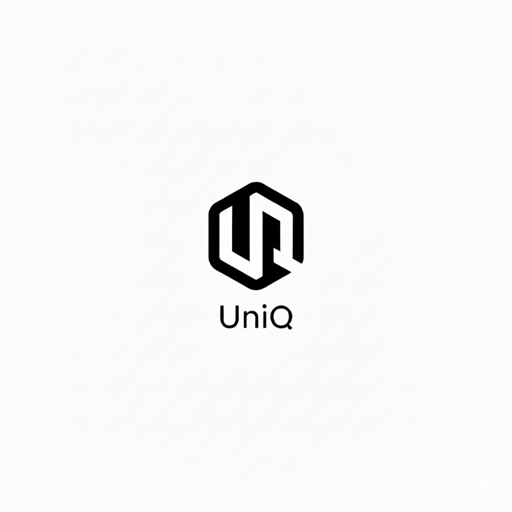
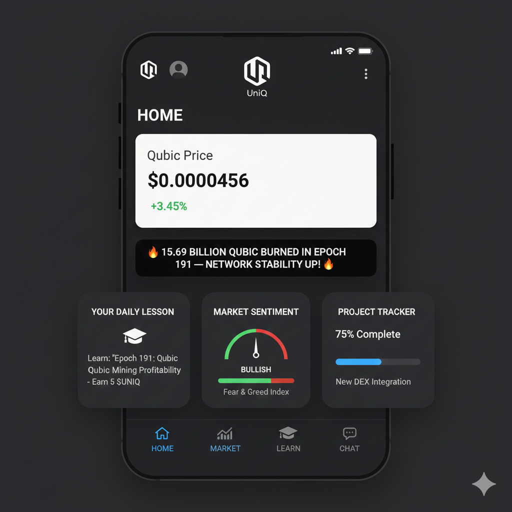
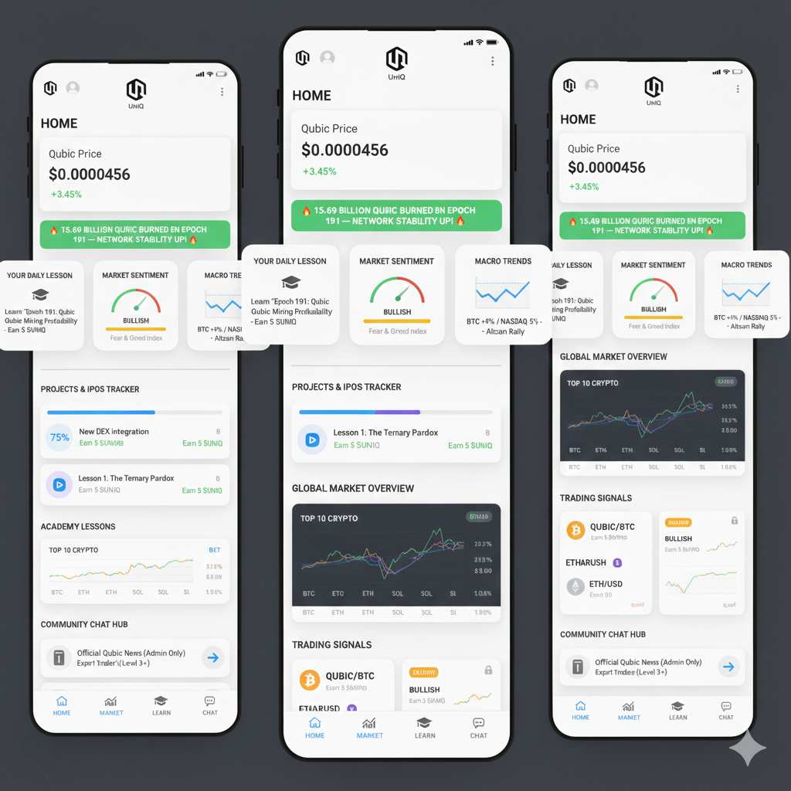
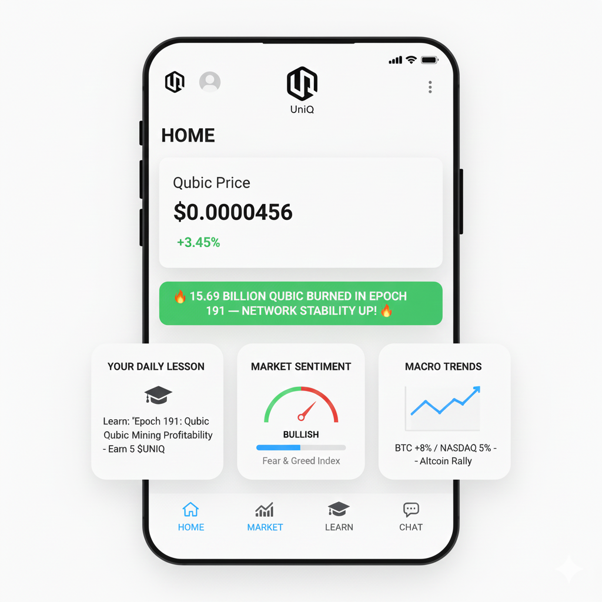
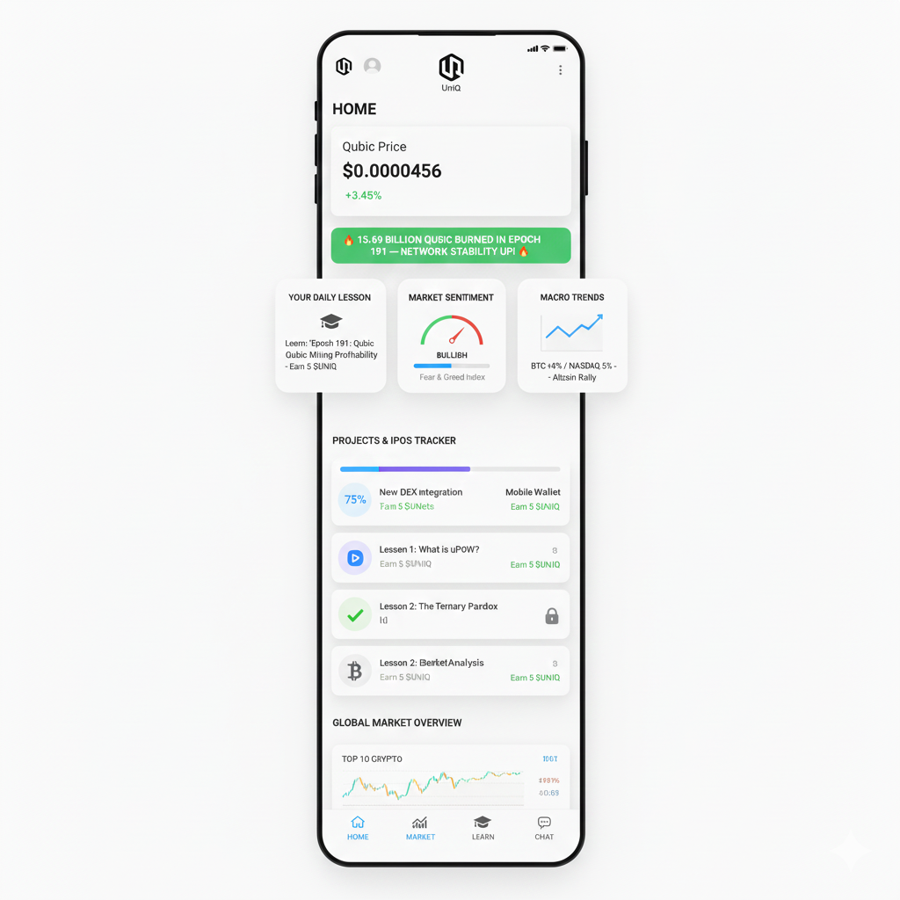

  

# UniQ: The Interactive Gateway to Qubic Academy 🎓🚀

**UniQ** is a gamified, mobile-first onboarding platform designed to act as the interactive interface for the official **Qubic Academy**. [span_0](start_span)[span_1](start_span)We transform complex technical documentation into engaging, rewarding learning experiences to turn passive observers into active participants.[span_0](end_span)[span_1](end_span)

---

## 📱 App Preview

  
  
  

  
  

---

## 🎯 Core Modules (MVP Focus)

* **[span_2](start_span)[span_3](start_span)Academy Mobile Portal:** A high-performance interface for official Qubic Academy lessons, optimized for mobile users.[span_2](end_span)[span_3](end_span)
* **[span_4](start_span)Learn-to-Earn (L2E) Engine:** Interactive courses where users earn $UNIQ rewards for completing lessons and passing quizzes about Qubic technology.[span_4](end_span)
* **[span_5](start_span)[span_6](start_span)Ecosystem Directory:** A transparency dashboard that monitors the progress and milestones of key projects within the Qubic network.[span_5](end_span)[span_6](end_span)
* **[span_7](start_span)User Dashboard & Gamification:** Personalized profiles tracking knowledge levels, badges, and activity to ensure long-term user retention.[span_7](end_span)

---

## 💎 $UNIQ Tokenomics (Summary)

$UNIQ is a **pure utility token** designed to power the UniQ application. It exists solely to incentivize learning, engagement, and long-term ecosystem participation.

**Total Supply:** 1,000,000,000 $UNIQ (Fixed)

| Allocation | Percentage | Purpose |
| :--- | :--- | :--- |
| **Learn-to-Earn Rewards** | 40% | [span_8](start_span)Direct user incentives for completing educational modules.[span_8](end_span) |
| **Ecosystem Incentives** | 20% | Growth and community engagement. |
| **Team & Advisors** | 20% | Long-term development (vested). |
| **Treasury / DAO** | 15% | Future project sustainability. |
| **Liquidity** | 5% | Ensuring platform stability. |

---

## 🤝 Strategic Alignment & ROI

* **[span_9](start_span)Marketing Synergy:** UniQ acts as a "Force Multiplier" by promoting official dApps through dedicated educational modules.[span_9](end_span)
* **[span_10](start_span)Community Education:** Reduces the burden on support channels by providing a self-service learning hub for new investors.[span_10](end_span)
* **[span_11](start_span)User Growth:** Significantly lowers the barrier to entry for the non-technical mass market.[span_11](end_span)
* **[span_12](start_span)Transparency:** Provides the community with a clear view of which projects are delivering milestones.[span_12](end_span)

---

## 🛠 Project Roadmap

- [x] Concept & UI Mockups
- [ ] **[span_13](start_span)Phase 1:** Launch of News, Market Feed, and Project Tracker (MVP).[span_13](end_span)
- [ ] **[span_14](start_span)Phase 2:** Implementation of the L2E Engine, Quiz system, and Reward logic.[span_14](end_span)
- [ ] **[span_15](start_span)Phase 3:** Non-custodial Wallet integration and Marketplace for educational content.[span_15](end_span)

---

## 👤 About the Developer
I am **old_source**, a long-time Qubic supporter and enthusiast. [span_16](start_span)UniQ is born from the vision of making Qubic the most accessible blockchain for the masses through superior education and UX.[span_16](end_span)

---

  <i>Built to support the Qubic Marketing & Academy Teams.</i>

