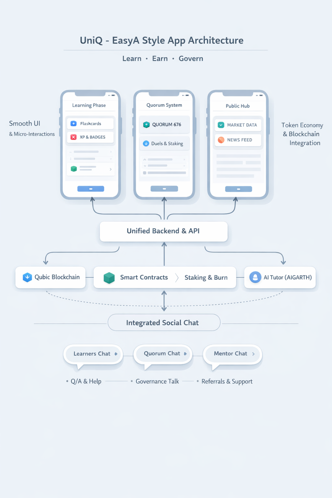
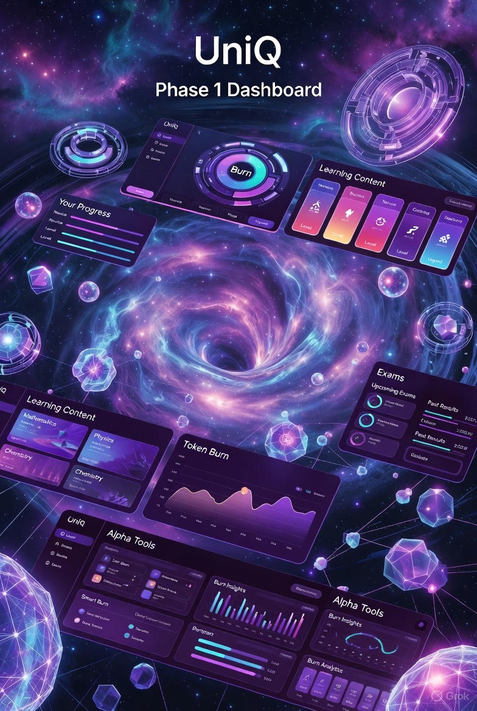
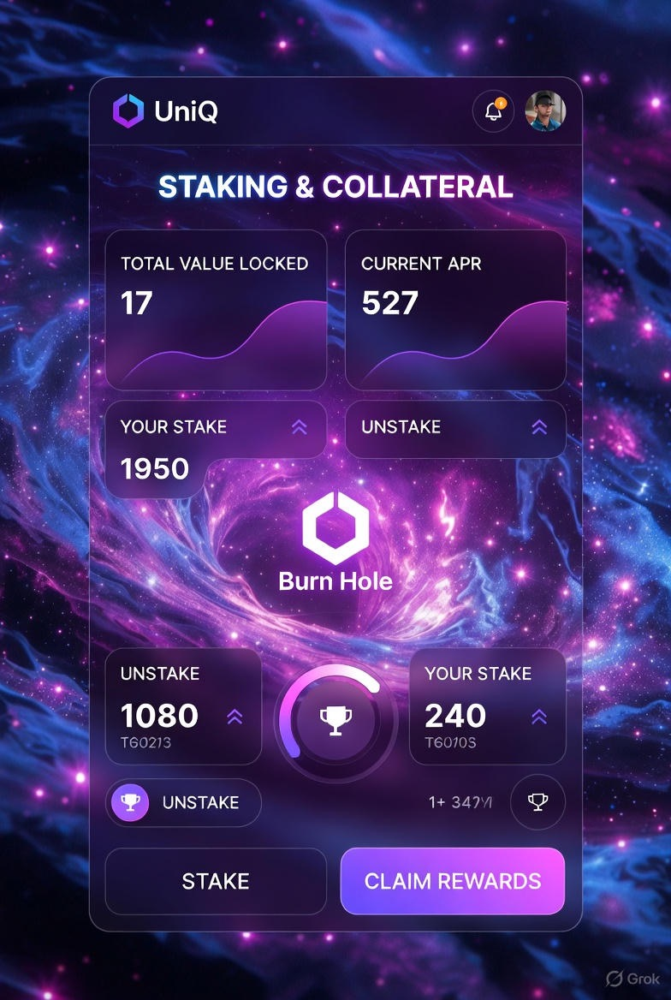
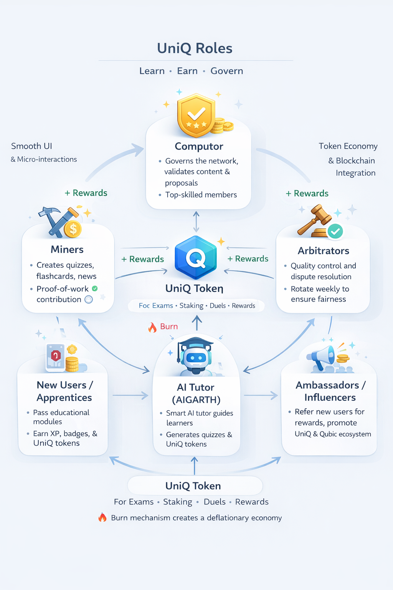
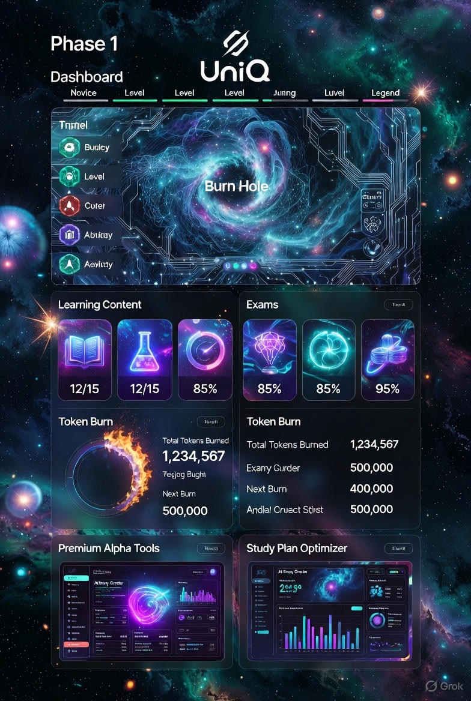
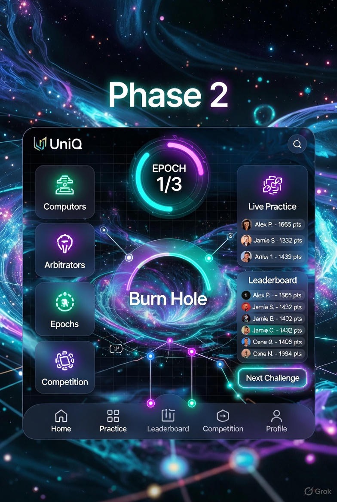
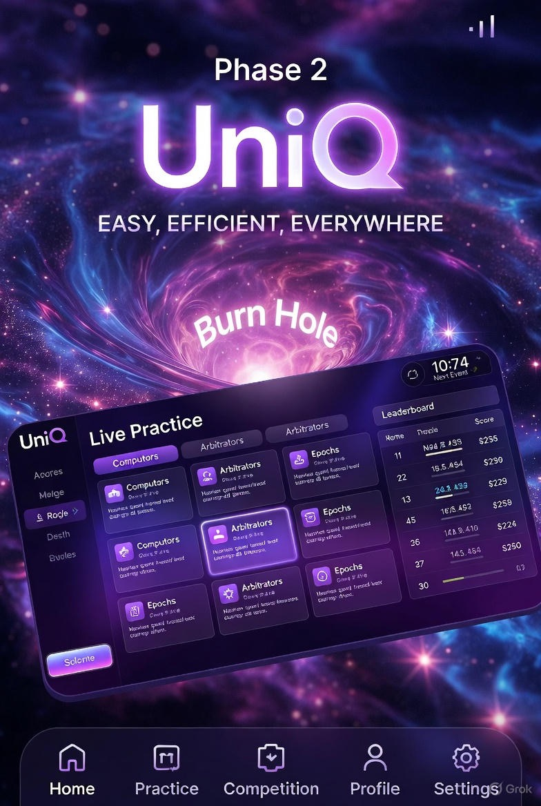
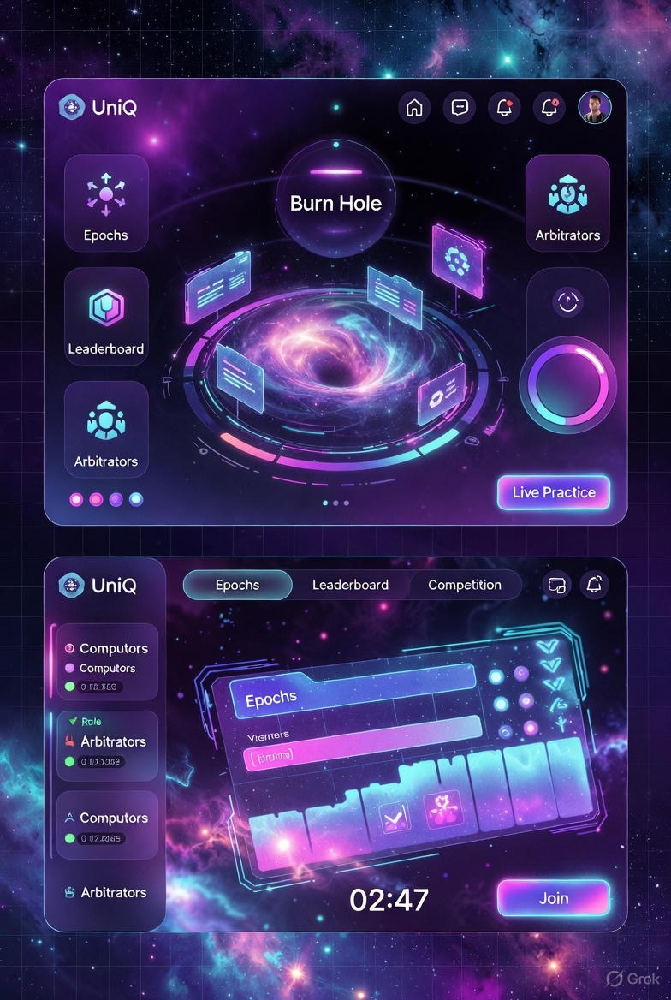
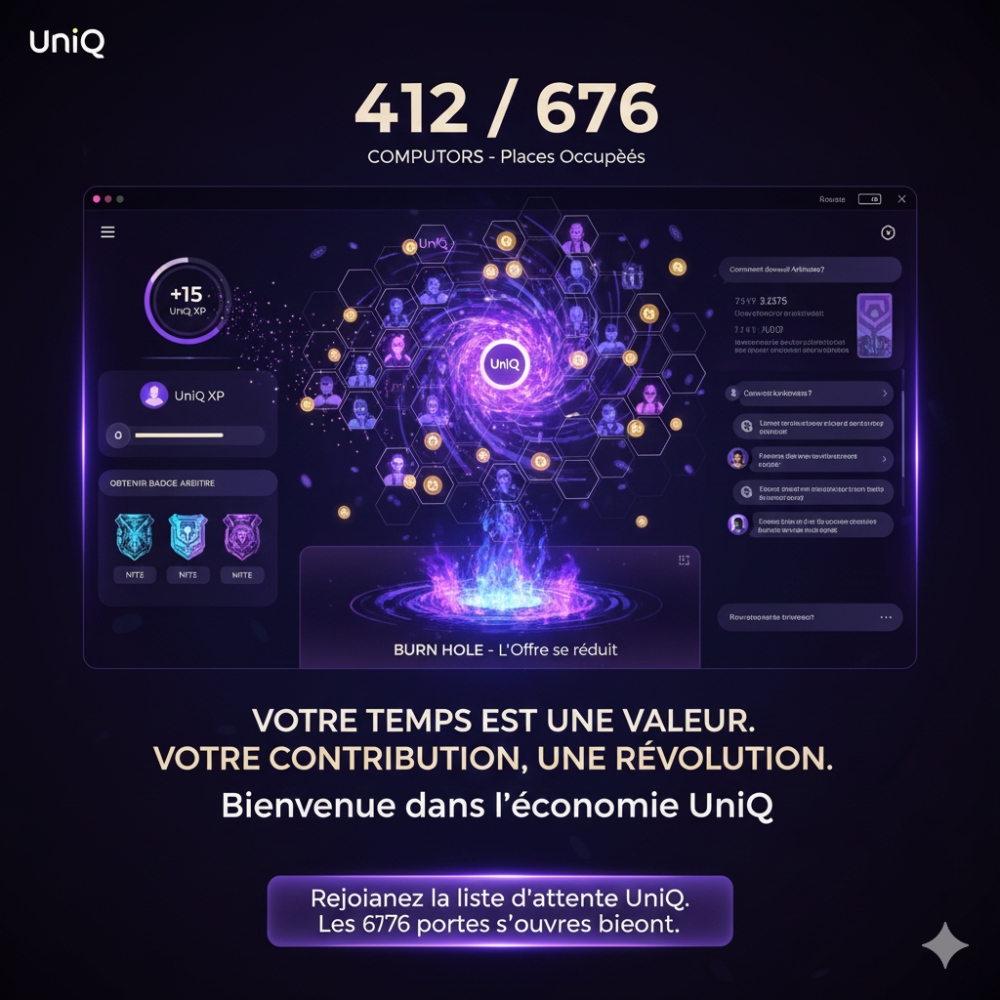

  

# UNIQ: Universal Intelligent Qubic
**White Paper + Tokenomics + SWOT + Risk & FAQ** *Educational & Governance Ecosystem for the Qubic Network*

---

## 1️⃣ Vision and Objectives

UniQ est une plateforme mobile **Learn-to-Earn** transformant l'engagement communautaire au sein de l'écosystème Qubic en une méritocratie active.

* **Expertise :** Transformer les utilisateurs passifs en *Power-Users* et ambassadeurs qualifiés.
* **Économie Circulaire :** Créer une valeur intrinsèque via le jeton UNIQ avec des mécanismes déflationnistes.
* **Simulateur de Réseau :** Reproduire la hiérarchie de Qubic (Quorum 676, Computors, Arbitrators, Miners) pour un apprentissage pratique.

---

## 2️⃣ User Journey and Grades

Le parcours utilisateur est conçu comme une ascension vers l'excellence, validée par des examens rigoureux.

* **Hiérarchie :** Novice → Pathfinder → Expert → Legend → Master.
* **Système d'Examen :** Accès aux grades supérieurs via paiement en UNIQ ; les examens échoués brûlent les jetons (Burn Effect).
* **Anti-Triche :** Qubic ID, banques de questions dynamiques, et minuteurs stricts.

---

## 3️⃣ Tokenomics & Circular Economy

### a) Total Supply & Allocation
**Total Supply : 20,000,000 UNIQ**

| Recipient | % | Tokens |
| :--- | :--- | :--- |
| **Community Rewards** | 55% | 11,000,000 |
| **Treasury / AI** | 20% | 4,000,000 |
| **Creator / Developer** | 15% | 3,000,000 |
| **Liquidity & Early Contrib.** | 10% | 2,000,000 |

### b) Le "Golden Split" (Flux de revenus)
Chaque UNIQ dépensé dans l'application suit cette répartition :
* **50% BURN :** Déflation automatique.
* **30% REWARDS :** Pour les Miners et Computors actifs.
* **20% TREASURY :** Maintenance et évolution de l'IA.

---

## 4️⃣ Governance & Roles (Phase 2)

UniQ prépare la communauté à la gouvernance réelle de Qubic via une simulation en temps réel.

* **Computors (676) :** Les membres d'élite validant le contenu.
* **Miners (uPoW) :** Créateurs de contenu pédagogique.
* **Arbitrators :** 50 juges hebdomadaires pour résoudre les litiges.
* **AIGARTH (AI Tutor) :** L'intelligence artificielle supervisant la Phase 1.

---

## 5️⃣ Roadmap : De la Forge à l'Expansion

### Phase 1: The Forge
Focus sur l'apprentissage massif et la montée en grade des premiers "Novices".

### Phase 2: Critical Competence Threshold (CCT)
Activation du Quorum des 676 dès que le seuil de 6 760 utilisateurs est franchi.

---

## 6️⃣ SWOT & Risk Management

| Forces | Faiblesses |
| :--- | :--- |
| Alignement total avec Qubic | Complexité initiale pour les débutants |
| Modèle économique ultra-déflationnaire | Dépendance à la croissance utilisateur |

**Sécurité :** Protection contre les attaques Sybil via le Qubic ID et rotation aléatoire des Arbitres pour éviter la collusion.

---

## 7️⃣ Join the Revolution

Le réseau UniQ n'attend que ses futurs leaders. Serez-vous parmi les 676 ?

---
*UniQ - Universal Intelligent Qubic | Powered by the Community*
